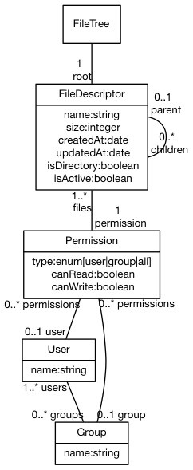

# MobileSync

React-Native application that uses GraphQL &amp; Relay to sync a filesystem

## Architecture

MobileSync is broke down in two dependent parts: the GraphQL file server and the
React/Relay client.

### Underlying FileSystem Model

Here is the most flexible filesystem authorization system we could create:

In our situation though, we'll not implement it completely.

### GraphQL Schema / Interface

GraphQL will expose a few types to query the filesystem.

